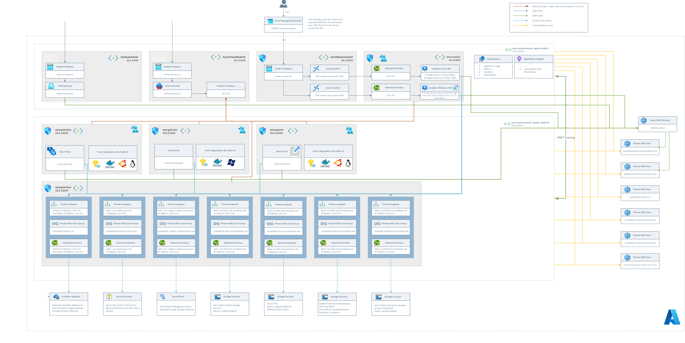

# Deploy Azure Batch in a Secured Environment

This goal of this repository is to demonstrate how Azure Batch could be deployed in a secured environment, which is often a requirement in regulated industries such as Pharma, Life Sciences or Banking and Capital Markets. 


## High-Level Overview




[](https://portal.azure.com/#create/Microsoft.Template/uri/https%3A%2F%2Fraw.githubusercontent.com%2Fmocelj%2FAzureBatch-Secured%2Fmain%2Fazuredeploy.json)

alternatively, if your organization requires ms.portal.azure.com, try this button: 

[](https://ms.portal.azure.com/#create/Microsoft.Template/uri/https%3A%2F%2Fraw.githubusercontent.com%2Fmocelj%2FAzureBatch-Secured%2Fmain%2Fazuredeploy.json)

[See explanation of the parameters](#Parameters)

## Short summary of the deployment:

Currently, the following resources are deployed to your Azure Subscription:

- Azure Batch will be deployed in User-Subscription mode 
- Azure Batch Service will be deployed in a private endpoint configuration
- All other services will be exposes through private endpoints. For instance: 

    - Storage (Blob, NFS Share, SMB Share)
    - Azure Key Vault
    - Azure Container Registry


- No puplic IPs are exposed on the pool nodes (thus any outgoing traffic will be routed through the Azure Firewall)

- The Azure Batch Pool will be deplyed with a Managed Identity which has the permissions to pull images from the Azure Container Registry

- In total, 3 pools will be deployed in individual subnets:
    - linux-dev-pool (Static Scaling,Azure Container Registry configured, NFS Share mounted)
    - linux-prod-pool (Auto Scaling enabled, Azure Container Registry configured, NFS Share mounted, connection to the nodes via ssh not allowed)
    - windows-dev-pool (Static Scaling, SMB Share mouted, Pyhton installed on nodes)


- A VPN Gateway will be deployed as part of the end-to-end example

- Azure Bastion Service will be deployed to allow access to the Linux and Windows Jumpboxes if a VPN Gateway is not desired.

- An Azure Firewall will be deployed and all internet bound traffic will be routed through Route Tables to the Azure Firewall. Rules are configured to allow Linux & Windows Updates and package retrieval.

- During the deployment a test docker container will be created and pushed to the secured ACR. The purpose of this container is to test the managed identity assigned to the pool by retrieving the list of secrets stored in the Key Vault and displaying it's name. The MI has RBAC permissions assingned on the Key Vault.

- The Windows Jumpbox will have the following software preinstalled: 
    - Azure Batch Explorer
    - Azure Storage Explorer
    - Azure CLI

- The Linux Jumpbox will have the following additonal packages preinstalled:
    -  azure-cli 
    - nfs-common 
    - jq 
    - will mount the blob storage (mounted through NFS 3)


## Additonal Notes:

- Make sure you have enough quota of the VM types selected, if you are deploying Azure Batch in User Subscription mode for the first time. [See Batch VM Sizes guidelines.](https://docs.microsoft.com/en-us/azure/batch/batch-pool-vm-sizes)

- Create a Certificate for the VPN Gateway and Configure a Point-to-Site configuration if desired. [You can start with the configuration here](https://docs.microsoft.com/en-us/azure/batch/batch-pool-vm-sizes)


## How to test your deployment

- Manually Scale the Linux-Dev and Windows-Dev Pools 
- Create a Job on each of the individual Azure Batch Pools
- For the Linux Pools: Create a task which will query the KV and list all secrets:
Replace GUID and ENV with the values created during your deployment
```
...

"commandLine": "python ./testKvSecrets.py -k kv-<ENV>-<GUID>-ba",
  "resourceFiles": [],
  "containerSettings": {
    "containerRunOptions": "--rm --workdir /app",
    "imageName": "acry<ENV><GUID>azbatch.azurecr.io/kvsecretsmi:latest",
    "workingDirectory": "taskWorkingDirectory"
  },

...
```
- For the Linux Pool with auto-scaling, test the scaling formula, with submitting 1,2, or multiple tasks. It will take a moment for the autoscaling to kick-in and provision the nodes. The nodes will be de-provisioned after the task execution.

- The Windows Pool can be tested by checking the installed python version:
```
...

  "commandLine": "cmd /c \"python -V\"",
  "resourceFiles": [],
  "environmentSettings": [],

...
```

## What's Next

- Monitoring of the components / Create an Azure Dashboard
- Add more examples do show-case how Azure Batch could be leveraged for HPC workloads
    - e.g. leverage Azure Redis Cache for Data Ingestion / Egress from Nodes
    - add an example which leverages Azure Batch Application Packages
    - add an example to showcase how to build a custom image and use it in Azure Batch

## Demo Add-ons

- [Custom DNS Server / Firewall Proxy](modules/Demos/03-Demo-Custom-DNS/README.md)

# l
## Parameters

| Parameter Name | Type | Default Value | Possible Values | Description |
| :-- | :-- | :-- | :-- | :-- |
| `resourceGroupLocation` | string | `westeurope` | [see list with regions in preview here](https://docs.microsoft.com/en-us/azure/batch/batch-pool-no-public-ip-address) |Optional. The region the resources will be deployed to. Default value will be applied in case nothing is provided|
| `environment` | string | `dev` | `3 character prefix` | Optional. Default value will be applied in case nothing is provided. |
| `prefix` | string | `unique string created by environment, Subscription Id and resourceGroupLocation` | `-<environment>-<guid>-` | Optional. Default value will be applied in case nothing is provided.  |
| ` deployHubSpoke` | bool | `true` | `true,false` | Optional. Indicate if Hub-Spoke Network should be deployed. Default value will be applied in case nothing is provided. |
| `ignoreDnsZoneNwLinks` | bool | `true` | `true,false` | Optional. Default value will be applied in case nothing is provided. |
| `eployJumpBoxVMs` | bool | `true` | `true,false` | Optional. Indicate if a Linux and Windows Jumpbox should be deployed. Default value will be applied in case nothing is provided.|
| `deployVPNGw` | bool | `false` | `true,false` | Optional. Indicate if a VPN Gateway should be deployed. Note: deployment may take up to 45 min addtional time. Certificate has to be added after creation. Default value will be applied in case nothing is provided.|
| `deploySecureBatch` | bool | `true` | `true,false` | Optional. Indicate if Azure Batch Demo should be deployed. Default value will be applied in case nothing is provided. |
| `adminUserName` | string | `localadmin` |  | Optional. Default value will be applied in case nothing is provided. |
| `adminPassword` | secure string |  |  | Required. |
| `resourceTags` | object | `{object}` |  | Optional. Tags of the resource. |
| `jumpboxLinuxVmSize` | string | `Standard_B1s` | `Standard_B1s,Standard_B2ms` | Optional. Size of the Linux Jumpbox. Default value will be applied in case nothing is provided. |
| `jumpboxWindowsVmSize` | string | `Standard_D4_v5` | `Standard_B2ms,Standard_B4ms,Standard_D4_v5` | Optional. Size of the Windows Jumpbox. Default value will be applied in case nothing is provided. |
| `batchServiceObjectId` | string | | az ad sp show --id "MicrosoftAzureBatch" --query objectId -o tsv' | Required. Objected Id of the the Azure Batch Service. Needed to grant contributor permissions in batch user subscription mode deployment. Execute the acli command to get the id. |
| `assignBatchServiceRoles` | bool | `true` | `true,false` | Optional. If Batch Service has already been granted contributor permissions to subscription, select false - otherwise, select true. Default value will be applied in case nothing is provided. |
| `batchNodeSku` | string | `Standard_D2s_v3` | `Standard_D2s_V3,Standard_D2s_V4,Standard_D2s_V5,Standard_F2s_v2,Standard_F4s_v2,Standard_F8s_v2,Standard_B2ms,Standard_B4ms,Standard_D4_v5` | Optional. Default value will be applied in case nothing is provided. |
