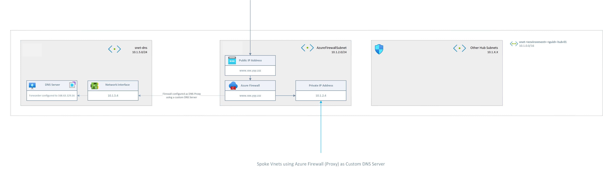

# Deploy Demo 3 Add-On: Custome DNS Server

The goal of this add-on is to demonstrate, how a custom DNS Server could be configured in conjunction with the Azure Firewall. 

Documentation - Work in Progress

## High-Level Overview

